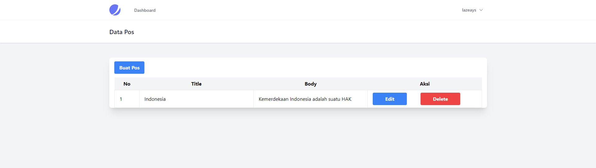
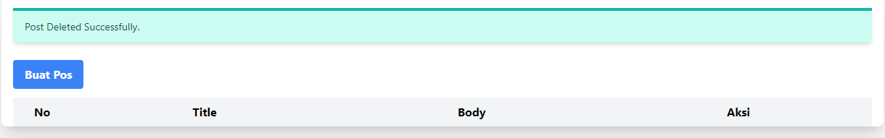
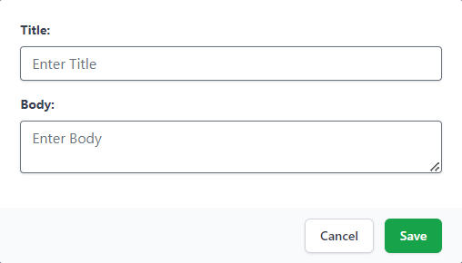
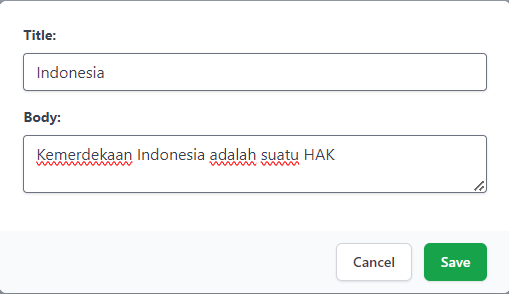

# Aplikasi Livewire CRUD
Pembuatan aplikasi Livewire CRUD menggunakan framework Laravel dengan library Tailwind CSS dengan memakai Jetstream. Pembuatan aplikasi ini dilakukan oleh Student Day Programming Website - SMA Plus PGRI Cibinong.


### Tutorial Menggunakan Aplikasi || Clone Repo

```bash
git clone https://github.com/novanzulhilmi/Livewirecrud.git
cd Livewirecrud
composer install
composer require laravel/jetstream
php artisan jetstream:install livewire
npm install
```
salin .env.example dan ubah namanya menjadi .env

lalu sesuaikan isinya pada baris 22-27 menjadi
```bash
DB_CONNECTION=mysql
DB_HOST=127.0.0.1
DB_PORT=3306
DB_DATABASE=tailwind
DB_USERNAME=root
DB_PASSWORD=
```
lanjutkan dengan perintah
```bash
php artisan migrate
code .
```
Buka Visual Studio Code dan buka terminal berikan perintah

```bash
php artisan serve
npm run dev
```
buka browser di http://127.0.0.1:8000
klik login, masukan username dengan email lazeays@gmail.com dan password lazeayss

## Screenshots

<table align="center" style="width: 100%;">
  <tr>
    <td width="50%"></td>
    <td width="50%"></td>
  </tr>
  <tr>
    <td width="50%"></td>
    <td width="50%"></td>
  </tr>
</table>

## Tools

**Client:** Laravel, TailwindCSS

## License

[Instagram - Novan Nur Zulhilmi Yardana](https://www.instagram.com/novan.zulhilmi/)